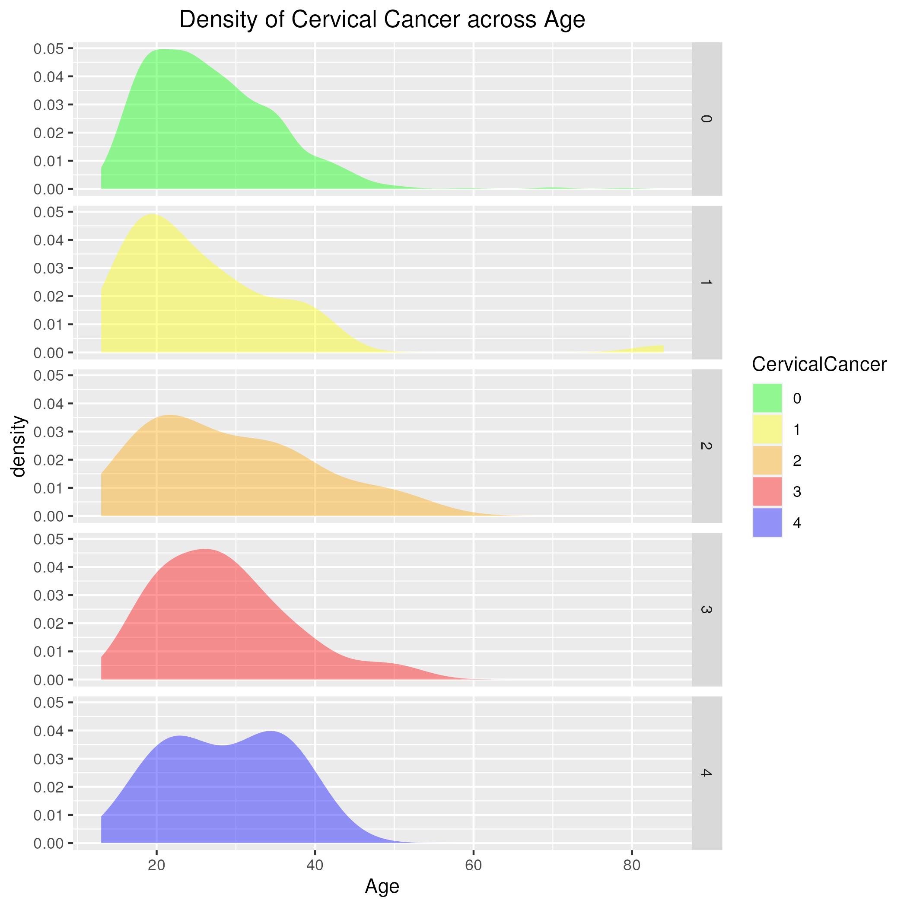

Cervical cancer is one of the deadliest diseases for women around the globe. In the recent world, the increasing amount of screenings has resulted in a significant decrease of cervical cancer mortality. However, in many of the developing countries, the lack of facilities and scarcity of attention still result in a monumental death rate. There are several factors including smoking, having multiple sexual partners, having sex at early age, various sexually transmitted diseases (STDs) and several behavioral characteristics will increase the risk of having cervical cancer. 

In this project, we aim to understand if there is a tendency for the presence of those risk factors will result in a higher rate of cervical cancer. To answer this question and explore other related questions, we use two datasets released from The University of California's at Irvine (UCI) database. The first dataset, named kag_risk_factors_cervical_cancer.csv, has 858 potential patients with 4 indicators/types of test results for cervical cancer includes Hinselmann, Schiller, Citology and Biopsy. The second dataset is comparatively small, named cervical_cancer_behave_risk.csv, with 73 potential patients and 1 binary response of 0 or 1 of not having cervical cancer or having cervical cancer.

For the first dataset, the 32 risk factors discribes in the dataset includes Age, Number of Sexual Partners, First Sexual Intercourse, Num of Pregnancies; 3 covariates on smoking: Smokes(binary 0/1), Smokes(in Years, smoke for how many years), Smokes(in packs/year, packs every year); 4 covariates on indicating having immense sexual activities that needs birth control method: Hormonal Contraceptives(binary 0/1), Hormonal Contraceptives(in years, how many years), IUD(binary 0/1), IUD(in years, how many years); 17 covariates on sexually transmitted disease(STDs): STDs(binary 0/1), STDs(numbers,0-12 count of diseases), 12 covariates of STDs(including 12 types of diseases: condylomatosis, cervical condylomatosis, vaginal condylomatosis, vulvo-perineal condylomatosis, syphilis, pelvic inflammatory disease, genital herpes, olluscum contagiosum, AIDS, HIV, Hepatitis B, HPV), STDs(Number of Dignosis, 0-12 times of Dignosis), STDs(in years, Time since first diagnosis), STDs(in years, Time since last diagnosis); 4 diagnosis of diseases without sexual transmission: Dx(in binary: other cancers, CIN, HPV, other diseases).    

For the second dataset, there includes 18 features of risks. Those are the indicators ranging from 0 of lowest to 15 heaviest amount. Very possibly a survey dataset. The 3 features related to 3 behaviors (sexual risk, eating, personal hygine), 2 related to intention (aggregation, commitment), 2 related to attitude (spontaneity, significant person), 2 related to perception (vulnerability, severity), 2 related to motivation (strength, willingness), 3 related to social support (emotion, appreciation, instrumental), 3 related to empowerment (knowledge, abilities, desires).

## Exploratory Data Analysis on Dataset 1

#### Bar Chart of Age Count

Age has been in integer values concentrated between age of 15 and 41. Maximal counts for age is 18 with 50 people, for age is 23 with 54 people. With age of 21 is 46 people, age of 20 is 45 people, age of 19 with 44 people. With 50+44+45+46+30+54=269 and age of 18 to 23 with 269/858=31% of people. The barplot skewed very much to the right. 

#### Bar Chart of Number of Sexual Partners

Most of sexual partners are of 1-3, 206 people with 1 partner, 272 people with 2 partners, 208 people with 3 parters. And there are 26 people with missing value. However, there are some very extreme values such as 15 and 28 partners both with 1 person. 

#### Bar Chart of Age of First Sexual Intercourse

Most counts of first sexual intercourse are between 14 and 21. It is more of a normal distribution than skewed distribution. The max age first intercourse is 5 people of age 29, 1 person of age 32. And 7 missing value for age of first sexual intercourse.

#### Bar Chart for Pregnancy counts:
Most of the women in the dataset having 1 to 2 pregnancies. With 56 missing value here. It's of very rare case to have 0 pregnancy of 16 people. There are some extreme values like 10 or 11 pregnancies with 1 person each. 

#### Combined Bar Chart of Smoke, Hormonal Contraceptives, IUD
Most smoking counts are of not smoking 0 with 722 people, smoking 1 with 123 people and 13 missing values. 
Here we have most people don't smoke. Smoking as one of the major factor leading to cervical cancer will be studied heavily later.  
Most are having hormonal contraceptive 1, with 481 people, having no hormonal contraceptive 0,
with 269 people and 108 missing values. 
Most are not having IUD 0, with 658 people, having IUD 1, with 83 people and 117 missing values. 
It shows for both of birth control methods there are around 100 people of missing value. However most people are now having birth control method in this dataset which means they are having regular amount of sexual activities.  

#### Checking linear trend between years of smoke and pack per year of smoke
We subset the dataset to only include the person who smokes. We compare years of smoke against smoke pack/year in a scatterplot to check whether there is a linear trend between the two covariates. From the plot shown, we do not see any significant linear trend for those two smoking covariates. The relationship is very complicated. 
However we can see that for people smoke less than ten years most of the people will smoke less pack per year. 
For people smoking more than ten years, the data points become very scattered. There are most of the people smoking less than ten packs/year however there are very extreme values for packs smoking. Especially for the person who smoke for 37 years. The potential patient number 4 of the dataset. 

#### Checking histogram and density of birth control treatment
We subset the dataset to hormonal contraceptives of being 1 and IUD of being 1 with no missing values of years of having hormonal contraceptives and years of having IUD.
We plot density diagram and histogram of hormonal contraceptives first. There are more than 100 patients having hormonal contraceptives and most of them are having 0-5 years. Maximal year is 30. There are about only a few percent with 10-30 years of hormonal contraceptives. 
We then plot the same for IUD. There are way fewer people having IUD to hormonal contraceptives. Maxial years is 19 years way shorter than having HC. 
The distribution of both are more of a bell shaped for IUD. And the most counts of having IUD are not closest to recent, not less than a year. However, for HC, most are taking about a year. 

#### Checking Histogram of Number of Sexually Transmitted Diseases(STDs)
We check from the histogram that 0 STD patients are the majority with 674 people. 34 people with only 1 STDs, 37 people with 2 STDs. Which only 7 people having 3 STDs together and 1 having 4 STDs together. 105 people having unknown condition on STDs.  

#### Checking Counts of STD Diseases
From checking the counts we have most for Condylomatosis with 44 people. 43 of them also have Vulvo Perineal Condylomatosis with huge overlaps. In the dataset the next two diseases are syphilis and HIV. We should invetigate more about Condylomatosis, HIV and Syphilis more later.

#### Checking the time of having first and last diagnosis
Most of the diagnosis time are missing values if the potential patients do not have STDs or of unknown condition. If patients having STDs checked, the time of diagnosis will always be recorded. 
We can see from the histogram that most counts are overlapping. It makes sense that most of the patients having STDs only have one or two types of such diseases. Most of the diagnosis time are within 5 years, have the maximal amount for within two years. The difference for first and last diagnosis time are more in a scattering fashion. 

#### Checking the type of non-sexually transmitted diseases apper in the dataset
We see that in most of the cases multiple diseases will occur together. The most frequent occurrence of single disease in the dataset is HPV. And in most of cases, 9 potential patients cancer, HPV and other diseases occur together in three. CIN does not occur concurrently with HPV and cancer at any time. We see that the people with HPV, cancer and people with CIN can be two different groups of people.

#### Checking the counts of cervical cancer positive result
We see that most of 756 people have no positive counts for cervical cancer test. 41 people with 1 type of cervical cancer test positive. 22 people with 2 types of positive and 33 people with 3 types of positive. 4 types of positive only counts for 6 people. We see that for being positive for 1 to 3 types it's not in a decreasing change in counts for testing positive. We should focus more on the testing positive cases. 

#### Checking the positive counts of four types of cervical cancer
We see from the horizontal barplot that Schiller and Biopsy always coexist and have a decent positive counts, occuring with hinselmann or biopsy or only those two. This lead to a significant amount of 3 positive tests. 
We see that Citology itself has a significant amount but not so much with Schiller or biopsy. And there is no Citology and Hinselmann occurrence. It seems Citology test is itself unique comparing to other tests. 
There is a significant amount of Schiller appears themselves also. There is no Hinselmann occur simultaneously with Schiller also. 
For Hinselmann there is very few appears themselves. Mostly will occur at the same time of Schiller and Bioposy. 
The relationship tends to be very complicated and we can apply correlation plot to further investigate the positive tests. 

 
#### Checking correlation between the four type of tests
We see that the most significant feature from the heatmap is citology is negatively correlated to all the other three. It means as the odds of getting tested positive by citology increases the odds of getting tested positive by the other three decreases.
For Hinselmann, Schiller and Bioposy both positively correlated to it. This means as the odds of testing positive for Hinselmann increases the odds for testing positive by the other two also increases. 
For Bioposy being positively crrelated to Schiller. This means as odds of testing positive by Bioposy increases, the odds of being tested positive by Schiller also increases. 
However, the correlation values are weak to moderate between 0.20-0.40. 

#### Checking density of cervical cancer across all ages
After conducting all analysis on single variable, we start to focus on the main study which is to study the which risk factors will lead to a high occurrence of cervical cancer. 
Even though from the above heatmap, we can observe that Citology is negatively correlated to other testing method. Here in case of convenience of bivariate/multivariate analysis, we still add up the four test method counts to get a factor of test counts range from 0 to 4. We assume 0 being no cervical cancer at all and 4 being very convinced on having cervical cancer. 
First we analysis the relationship between age and cervical cancer. We can see that age is somewhat related to cervical cancer. There occurs distribution difference on the five density plots (from 0 through 4). Especially for 2 and 4 having a more significant change in distribution. 

#Checking density of number of sexual partners against counts positive test
As we see the density distribution varies more when the counts of positive test increases. This shows that sexual partners influence very much of the cervical cancer positiveness.

#Checking density of time of first intercourse against counts positive test
Distribution varies significantly for 3 and 4 tests being positive comparing to 0 test being positive. We see that people having very early first intercourse will lead to very probable cervical cancer from the cervical cancer of 4. 
For cervical cancer of 3, we have a very peaked 18 years old first intercourse comparing to much flatter 0, 1 and 2. 

#### Checking density of smoke impacting the distribution of amount of positive tests
We see not so much difference for distribution of smoking or not smoking. Binary variable of smoke is not a key factor to having cervical cancer or not. 

#### Checking for both Density Plots above
We see that the distribution varies significantly for both smoking years and smoking pack per year from 0 to even 1 count of having cervical cancer. Both variables are very significant risk factors for having cervical cancer. 

#### Checking for the density of having cervical cancers for having how many years of hormonal contraceptives
We see that the peak of such density plot is always stay at the center for most of potential patients having hc in two years. However, when cervical cancer testing positive for multiple tests, the peak shrink immensely and the tail running further away. This means for patients having longer hc will almost for sure having cervical cancer.  

#### Checking for the density of having IDC for having how many years of IDC
We see that though the peak are still centered at 0 the four all five conditions. The peak varies more randomly than hc. Which we have the highest peak for cervical cancer of 0 and the peak is very gradual for 1 and 2. Then the peak increases on 3 and 4 but not as high as 0. It certainly tells IDC is a more seldomly using treatment than hc. 

#### Checking Correlation Heatmap between all IDC covariates and Cervical Cancer Counts
We see from the heatmap, IDC disease count has more of a correlation to cervical cancer counts as this count variable weighted much more. For most of the STD diseases, the people having diseases are a bit less count. We may investigate more using other techniques. 
The correlation between STDs are mostly positively correlated. This means the increase of odds of having sexually transmitted diseases will lead to the increase of cervical cancer.  

#### Checking Correlation Heatmap between all Dx covariates and Cervical Cancer Counts
We see from the heatmap, we see that CIN has a negative correlation to Hinselmann, Schiller, Citology wuth the bigger Pearson values here. CIN's positive correlation to biopsy is also evident. 
For HPV and cancer are very correlated. Both have positive correlation to all four test indices. This means cancer and HPV are two of the proboble factors leading to cervical cancer. 
For other diseases, it has a very similary situation to CIN. 

#### Feature Selection Using Random Forest for people Having Cervical Cancer as response
We select significant covariates from previous examinations. Here we choose Age, Number.of.sexual.partners, First.sexual.intercourse, Num.of.pregnancies,
Smokes..years.,Smokes..packs.year.,Hormonal.Contraceptives..years.,IUD..years.,
STDs..number.,STDs..Time.since.first.diagnosis,STDs..Time.since.last.diagnosis,
Dx.Cancer,Dx.CIN.. 
We define a control use random forest with 5 times of repeats and 10 folds. We split the dataset into training of 80% and testing of 20%. Change NAs to -1 here for convinence. 
We get the result that the most significant feature is Dx.Cancer, with 19.43 of variable importance. Then is STD number with 13.59 and then is years of IUD and Hormonal Contraceptive, number of pregnancies, STD.Time since first and last diagnosis, Age. 
Quite suprisingly no features regarding smoking in such a selection. 

#### Selecting Important Features on Sexually Transmitted Diseases Impacting Cervical Cancer:
We only see Syphilis, HIV, V.Condy being important. And since the cases of STDs are comparatively small and a lot of condylomatosis presented or we use -1 representing NAs. We may need furthur investigation on STDs using different methods. 

#### Selecting Importance Feature for all covariates using Boruta
We can see that the green ones are of very good importance. We see Smokes..packs.year., Hormonal.Contraceptives, Hormonal.Contraceptives..years., IUD, IUD..years., STDs..number., STDs.condylomatosis, STDs.HIV, STDs..Time.since.first.diagnosis, STDs..Time.since.last.diagnosis, Dx.Cancer, Dx.HPV, Dx are of very good importance. This corresponds fairly well with previous feature selections. And from the other ggplots plotted previously. 

### Exploratory Data Analysis of Dataset2:

#### Dendogram providing clustering information
Such a dendogram can provide some very basic clustering information of the dataset2 based on the count of potential patients. Here I assigned 9 clusters for such a dendogram. 

#### Gap Statistics Plot Providing More Acurrate Clustering Information
From the plot, we can observe from the optimal gap statistc k which is 8. This is a very large clustering number for only 72 potential patients. 

#### Visualizing the Clustering Result of K-Means
With 8 optimal clusters, we see most of the clusters are of moderate size and two clusters are very small of 1 and 3. Two clusters overlapped of 2 and 7. The two dimension has a very low percentage. 

#### Visualization regarding having cervical cancer or not
We see that for the cluster of having cervical cancer. Both trend heavily negative comparing to the two dimension axis. However for people not having cancer, there is not a significant trend for either positive or negative on the dimensions. 

#### Visualizing the correlation between the covariates
We see that most of the covariates are positively correlated. Especially for those who contributed a lot among the PCA. Some of the covariates are perpendicular to the other most covariates which including norm and perception. 
For those contributing weakly towards PCA, like attitude, behave and intention have a more diverged relationship. 

#### Visualizing correlation using actual corrrelation plot
We see that willingness of motivation significantly positively correlated with all social support and empowerment, all social support and empowerment internally very correlated also. Norm and perception also internally positively correlated. 
For other not mentioning covariates are only very weakly correlated. 
The most evident from the plot is almost all covariates negatively related to having cervical cancer.This means the lower the values of any behaviral features the higher the chance of the person having cervical cancer.  

#### Feature Selection of Significant Covariates in Dataset2
We observe from the plot that behavior of sexualRisk and personalHygine, norm of significantPerson and fulfillment, perception of vulnerability and severity, motivation of strength and willingness, social support of emotionality, appreciation and instrumental, empowerment of knowledge, abilities and desire are the significant factors to determine whether of having cervical cancer.  

#### Summary 
We have found the possiblities of significant parameters above. However, the above dataset with only 72 observations, there are 14 covariates, this is immensely overfit. With a logistic model being employed, most of the covariates will have a z-value of very close to 0 to 6 to 7 digits. This is not a desirable conclusion to be made. 

The piority for the future step is to employ a better feature selection technique than this. Appropriate may be using the method like the first dataset by random forest and choose top 5 candidates of covariates. Or if there are some better nonparametric methods can be employed. 

The second dataset is far from perfect with only 72 observations. We should also employ a much bigger observations dataset in comparable to the first dataset. Alongside from the experiment of second dataset, we face much of inconvenience on clustering and plotting correlation plot. 

To conclude for the second dataset, we have seen from the correlation plot above that most covariates are negatively correlated to having cervical cancer. This means a person with low desire or behaves with result in a higher risk of having cervical cancer. 

Alongside, we see from the feature selection that there are a lot of factors, a lot of time unstable, like 20 factors can result in a increase of chance of exposure to cervical cancer. In the behavioral science perspective, those covariates can also be very correlated. In the future, if we can obtain a bigger dataset, we can investigate the interaction between significant covariates in a more detailed fashion. 

For the first dataset, we should obtain more samples with sexually transmitted diseases patients to see whether there is a tendency those diseases can result in a higher risk of having cervical cancer more clearly. Also, we should investigate with a more biological background involved, for a better understanding of whicb STD disease will result in a higher chance of having cervical cancer. 

On the other side, we have found the significant covariates in dataset1. It must involves smoking amount, the two kinds of birth control treatments, the cancer and other non STD diseases. We should have a better understanding of their relationship if we can run a more formal regression analysis and model selection on the dataset. 

