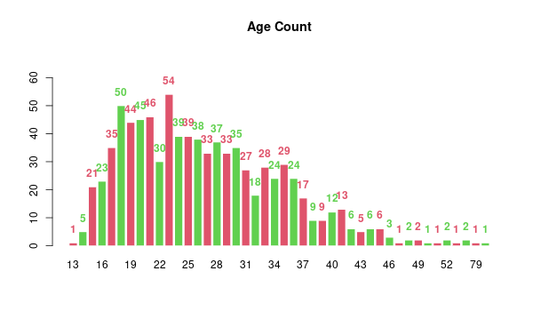
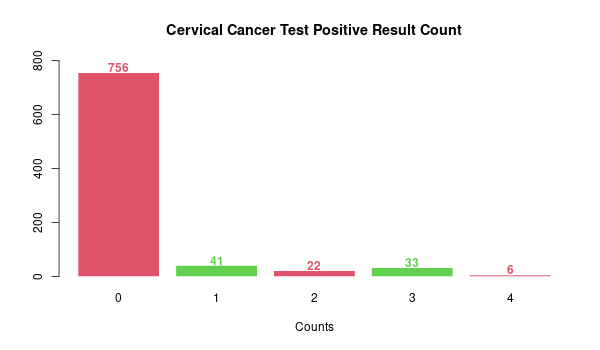

Cervical cancer is one of the deadliest diseases for women around the globe. In the recent world, the increasing amount of screenings has resulted in a significant decrease of cervical cancer mortality. However, in many of the developing countries, the lack of facilities and scarcity of attention still result in a monumental death rate. There are several factors including smoking, having multiple sexual partners, having sex at early age, various sexually transmitted diseases (STDs) and several behavioral characteristics will increase the risk of having cervical cancer. 

In this project, we aim to understand if there is a tendency for the presence of those risk factors will result in a higher rate of cervical cancer. To answer this question and explore other related questions, we use two datasets released from The University of California's at Irvine (UCI) database. The first dataset, named kag_risk_factors_cervical_cancer.csv, has 858 potential patients with 4 indicators/types of test results for cervical cancer includes Hinselmann, Schiller, Citology and Biopsy. The second dataset is comparatively small, named cervical_cancer_behave_risk.csv, with 73 potential patients and 1 binary response of 0 or 1 of not having cervical cancer or having cervical cancer.

For the first dataset, the 32 risk factors discribes in the dataset includes Age, Number of Sexual Partners, First Sexual Intercourse, Num of Pregnancies; 3 covariates on smoking: Smokes(binary 0/1), Smokes(in Years, smoke for how many years), Smokes(in packs/year, packs every year); 4 covariates on indicating having immense sexual activities that needs birth control method: Hormonal Contraceptives(binary 0/1), Hormonal Contraceptives(in years, how many years), IUD(binary 0/1), IUD(in years, how many years); 17 covariates on sexually transmitted disease(STDs): STDs(binary 0/1), STDs(numbers,0-12 count of diseases), 12 covariates of STDs(including 12 types of diseases: condylomatosis, cervical condylomatosis, vaginal condylomatosis, vulvo-perineal condylomatosis, syphilis, pelvic inflammatory disease, genital herpes, olluscum contagiosum, AIDS, HIV, Hepatitis B, HPV), STDs(Number of Dignosis, 0-12 times of Dignosis), STDs(in years, Time since first diagnosis), STDs(in years, Time since last diagnosis); 4 diagnosis of diseases without sexual transmission: Dx(in binary: other cancers, CIN, HPV, other diseases).    

For the second dataset, there includes 18 features of risks. Those are the indicators ranging from 0 of lowest to 15 heaviest amount. Very possibly a survey dataset. The 3 features related to 3 behaviors (sexual risk, eating, personal hygine), 2 related to intention (aggregation, commitment), 2 related to attitude (spontaneity, significant person), 2 related to perception (vulnerability, severity), 2 related to motivation (strength, willingness), 3 related to social support (emotion, appreciation, instrumental), 3 related to empowerment (knowledge, abilities, desires).

##Exploratory Data Analysis on Dataset 1

###Bar charts to visualize the essential covariates in the dataset

#### Bar Chart of Age Count

Age has been in integer values concentrated between age of 15 and 41. Maximal counts for age is 18 with 50 people, for age is 23 with 54 people. With age of 21 is 46 people, age of 20 is 45 people, age of 19 with 44 people. With 50+44+45+46+30+54=269 and age of 18 to 23 with 269/858=31% of people. The barplot skewed very much to the right. 

#### Bar Chart of Number of Sexual Partners

Most of sexual partners are of 1-3, 206 people with 1 partner, 272 people with 2 partners, 208 people with 3 parters. And there are 26 people with missing value. However, there are some very extreme values such as 15 and 28 partners both with 1 person. 

####Bar Chart of Age of First Sexual Intercourse

Most counts of first sexual intercourse are between 14 and 21. It is more of a normal distribution than skewed distribution. The max age first intercourse is 5 people of age 29, 1 person of age 32. And 7 missing value for age of first sexual intercourse.

####Combined Bar Chart of Smoke, Hormonal Contraceptives, IUD
Most smoking counts are of not smoking 0 with 722 people, smoking 1 with 123 people and 13 missing values. 
Here we have most people don't smoke. Smoking as one of the major factor leading to cervical cancer will be studied heavily later.  
Most are having hormonal contraceptive 1, with 481 people, having no hormonal contraceptive 0,
with 269 people and 108 missing values. 
Most are not having IUD 0, with 658 people, having IUD 1, with 83 people and 117 missing values. 
It shows for both of birth control methods there are around 100 people of missing value. However most people are now having birth control method in this dataset which means they are having regular amount of sexual activities.  

####Checking linear trend between years of smoke and pack per year of smoke
We subset the dataset to only include the person who smokes. We compare years of smoke against smoke pack/year in a scatterplot to check whether there is a linear trend between the two covariates. From the plot shown, we do not see any significant linear trend for those two smoking covariates. The relationship is very complicated. 
However we can see that for people smoke less than ten years most of the people will smoke less pack per year. 
For people smoking more than ten years, the data points become very scattered. There are most of the people smoking less than ten packs/year however there are very extreme values for packs smoking. Especially for the person who smoke for 37 years. The potential patient number 4 of the dataset. 

####Checking histogram and density of birth control treatment
We subset the dataset to hormonal contraceptives of being 1 and IUD of being 1 with no missing values of years of having hormonal contraceptives and years of having IUD.
We plot density diagram and histogram of hormonal contraceptives first. There are more than 100 patients having hormonal contraceptives and most of them are having 0-5 years. Maximal year is 30. There are about only a few percent with 10-30 years of hormonal contraceptives. 
We then plot the same for IUD. There are way fewer people having IUD to hormonal contraceptives. Maxial years is 19 years way shorter than having HC. 
The distribution of both are more of a bell shaped for IUD. And the most counts of having IUD are not closest to recent, not less than a year. However, for HC, most are taking about a year. 

####Checking Histogram of Number of Sexually Transmitted Diseases(STDs)
We check from the histogram that 0 STD patients are the majority with 674 people. 34 people with only 1 STDs, 37 people with 2 STDs. Which only 7 people having 3 STDs together and 1 having 4 STDs together. 105 people having unknown condition on STDs.  

####Checking Counts of STD Diseases
From checking the counts we have most for Condylomatosis with 44 people. 43 of them also have Vulvo Perineal Condylomatosis with huge overlaps. In the dataset the next two diseases are syphilis and HIV. We should invetigate more about Condylomatosis, HIV and Syphilis more later.

####Checking the time of having first and last diagnosis
Most of the diagnosis time are missing values if the potential patients do not have STDs or of unknown condition. If patients having STDs checked, the time of diagnosis will always be recorded. 
We can see from the histogram that most counts are overlapping. It makes sense that most of the patients having STDs only have one or two types of such diseases. Most of the diagnosis time are within 5 years, have the maximal amount for within two years. The difference for first and last diagnosis time are more in a scattering fashion. 

####Checking the type of non-sexually transmitted diseases apper in the dataset
We see that in most of the cases multiple diseases will occur together. The most frequent occurrence of single disease in the dataset is HPV. And in most of cases, 9 potential patients cancer, HPV and other diseases occur together in three. CIN does not occur concurrently with HPV and cancer at any time. We see that the people with HPV, cancer and people with CIN can be two different groups of people.

####Checking the counts of cervical cancer positive result
We see that most of 756 people have no positive counts for cervical cancer test. 41 people with 1 type of cervical cancer test positive. 22 people with 2 types of positive and 33 people with 3 types of positive. 4 types of positive only counts for 6 people. We see that for being positive for 1 to 3 types it's not in a decreasing change in counts for testing positive. We should focus more on the testing positive cases. 

